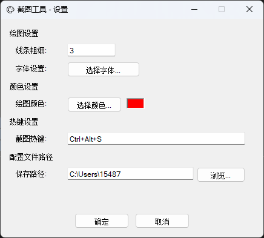

# 截图工具 (Screenshot Tool)

一个功能丰富的Windows原生截图工具，支持截图、标注、OCR文字识别等功能。

> 🚀 **最新更新**: 项目已完成重大架构重构，从单体应用升级为现代化的模块化架构，提供更好的代码组织、可维护性和扩展性。

## ✨ 主要功能

### 📸 截图功能
- **全屏截图**: 支持全屏幕截图
- **区域选择**: 鼠标拖拽选择任意区域
- **窗口检测**: 自动高亮检测到的窗口边界
- **实时预览**: 截图过程中实时显示选择区域

### 🎨 绘图标注
- **绘图工具**: 矩形、圆形、箭头、自由画笔
- **文字标注**: 支持添加文字说明
- **颜色选择**: 多种颜色可选
- **线条粗细**: 可调节绘图线条粗细
- **撤销功能**: 支持撤销上一步操作

### 🔍 OCR文字识别
- **智能识别**: 基于PaddleOCR引擎的高精度文字识别
- **结果展示**: 独立窗口显示识别结果和原图
- **多语言支持**: 支持5种语言的OCR识别
  - 🇨🇳 **简体中文** (默认) - 最稳定，识别精度最高
  - 🇺🇸 **英文** - 支持英文文本识别
  - 🇹🇼 **繁体中文** - 支持繁体中文识别
  - 🇯🇵 **日文** - 支持日文文本识别
  - 🇰🇷 **韩文** - 支持韩文文本识别
- **语言切换**: 在设置界面可选择OCR识别语言
- **智能配置**: 根据选择的语言自动加载对应的识别模型
- **异步启动**: OCR引擎异步启动，不阻塞界面操作
- **状态指示**: OCR按钮根据引擎状态自动启用/禁用

### 📌 固钉功能
- **窗口固钉**: 将截图结果固定在桌面上
- **拖拽移动**: 固钉窗口支持拖拽移动
- **始终置顶**: 固钉窗口始终显示在最前面

### 💾 保存功能
- **快速保存**: 一键保存到剪贴板
- **文件保存**: 支持保存为PNG等格式
- **自定义路径**: 用户可选择保存位置

### 🔧 系统集成
- **系统托盘**: 最小化到系统托盘运行
- **全局热键**: `Ctrl+Alt+S` 快速启动截图
- **右键菜单**: 托盘右键菜单快速访问功能
- **设置界面**: 简洁的设置窗口，支持OCR语言选择

## 🚀 快速开始

### 安装要求
- Windows 10/11
- 支持Direct2D的显卡
- **PaddleOCR引擎**: 需要 `PaddleOCR-json_v1.4.1` 文件夹与主程序在同一目录

### 文件结构
```
截图工具/
├── sc_windows.exe                    # 主程序
├── PaddleOCR-json_v1.4.1/        # OCR引擎文件夹
│   ├── PaddleOCR-json.exe          # OCR主程序
│   ├── models/                      # 识别模型文件
│   │   ├── config_en.txt           # 英文识别配置
│   │   ├── config_chinese_cht.txt  # 繁体中文识别配置
│   │   ├── config_japan.txt        # 日文识别配置
│   │   ├── config_korean.txt       # 韩文识别配置
│   │   └── *.infer/                # 各语言识别模型
│   └── *.dll                        # 运行时依赖库
└── README.md                        # 说明文档

开发环境文件结构/
├── src/                             # 主程序源代码（现代化模块架构）
│   ├── main.rs                      # 程序入口点
│   ├── lib.rs                       # 库入口和模块声明
│   ├── app.rs                       # 应用程序主协调器
│   ├── message.rs                   # 消息驱动系统（Command/Message）
│   ├── event_handler.rs             # 事件处理器traits
│   ├── command_executor.rs          # 命令执行器
│   ├── types.rs                     # 核心类型定义
│   ├── constants.rs                 # 应用常量
│   ├── error.rs                     # 统一错误处理
│   ├── settings.rs                  # 设置管理
│   ├── ocr.rs                       # OCR功能集成
│   ├── ocr_result_window.rs         # OCR结果窗口
│   ├── file_dialog.rs               # 文件对话框
│   ├── drawing/                     # 绘图管理器模块
│   │   ├── mod.rs                   # 绘图管理器主体
│   │   ├── elements.rs              # 绘图元素管理
│   │   ├── history.rs               # 历史记录（撤销/重做）
│   │   ├── rendering.rs             # 绘图渲染
│   │   ├── text_editing.rs          # 文本编辑功能
│   │   └── tools.rs                 # 绘图工具管理
│   ├── screenshot/                  # 截图管理器模块
│   │   ├── mod.rs                   # 截图管理器主体
│   │   ├── capture.rs               # 屏幕捕获
│   │   ├── save.rs                  # 保存功能
│   │   └── selection.rs             # 选择区域管理
│   ├── ui/                          # UI管理器模块
│   │   ├── mod.rs                   # UI管理器主体
│   │   ├── toolbar.rs               # 工具栏组件
│   │   ├── cursor.rs                # 光标管理
│   │   └── svg_icons.rs             # SVG图标管理
│   ├── system/                      # 系统管理器模块
│   │   ├── mod.rs                   # 系统管理器主体
│   │   ├── hotkeys.rs               # 热键管理
│   │   ├── tray.rs                  # 系统托盘
│   │   ├── ocr.rs                   # OCR引擎管理
│   │   └── window_detection.rs      # 窗口检测
│   ├── platform/                    # 平台抽象层
│   │   ├── mod.rs                   # 平台模块入口
│   │   ├── traits.rs                # 平台无关接口定义
│   │   └── windows/                 # Windows平台实现
│   │       ├── mod.rs               # Windows模块入口
│   │       ├── d2d.rs               # Direct2D渲染器
│   │       ├── gdi.rs               # GDI功能
│   │       └── system.rs            # Windows系统调用
│   ├── interaction/                 # 交互处理模块
│   │   └── mod.rs                   # 交互控制器
│   └── utils/                       # 工具函数模块
│       ├── mod.rs                   # 工具模块入口
│       ├── command_helpers.rs       # 命令辅助函数
│       ├── d2d_helpers.rs           # Direct2D辅助函数
│       ├── interaction.rs           # 交互辅助函数
│       └── win_api.rs               # Windows API封装
├── paddleocr/                       # 本地PaddleOCR库
│   ├── src/lib.rs                   # PaddleOCR Rust封装
│   └── Cargo.toml                   # 本地库配置
├── PaddleOCR-json_v1.4.1/        # OCR引擎文件夹
├── icons/                           # SVG图标资源
├── Cargo.toml                       # 项目配置
└── README.md                        # 说明文档
```

### 使用方法

1. **启动程序**: 运行exe文件，程序将最小化到系统托盘
   - 程序启动时会自动检测PaddleOCR引擎
   - 如果检测到OCR引擎，会异步启动并准备就绪
2. **开始截图**:
   - 使用热键 `Ctrl+Alt+S`
   - 或点击托盘图标
3. **选择区域**: 鼠标拖拽选择要截图的区域
4. **标注编辑**: 使用工具栏进行绘图标注
5. **文字识别**:
   - 点击OCR按钮识别图片中的文字
   - 如果OCR引擎未就绪，按钮会显示为灰色不可点击
   - 引擎就绪后按钮自动变为可用状态
   - 识别结果会在新窗口中显示，包含原图和识别的文字
6. **OCR语言设置**:
   - 右键点击系统托盘图标，选择"设置"
   - 在设置窗口中选择"OCR识别语言"
   - 可选择：简体中文、英文、繁体中文、日文、韩文
   - 点击"确定"保存设置，下次OCR时会使用选择的语言
7. **保存结果**:
   - 点击确认按钮保存到剪贴板
   - 点击保存按钮选择文件保存位置
   - 点击固钉按钮将截图固定在桌面

### 工具栏说明
- 🏹 **箭头**: 选择和移动工具
- ⬜ **矩形**: 绘制矩形框
- ⭕ **圆形**: 绘制圆形
- ✏️ **画笔**: 自由绘制
- 📝 **文字**: 添加文字标注
- ↩️ **撤销**: 撤销上一步操作
- 🔍 **OCR**: 文字识别
- 💾 **保存**: 保存到文件
- 📌 **固钉**: 固定到桌面
- ✅ **确认**: 保存到剪贴板并关闭
- ❌ **取消**: 取消截图

## 🛠️ 技术特性

### 🏗️ 现代化架构设计
- **分层模块化架构**: 采用现代Rust最佳实践，按功能域清晰分离模块
- **应用协调器模式**: `App`结构体作为主控制器，统一管理各个业务管理器
- **消息驱动架构**: 通过`Command`/`Message`枚举实现组件间松耦合通信
- **事件处理器模式**: 使用trait系统定义统一的事件处理接口
- **平台抽象层**: `PlatformRenderer` trait提供跨平台渲染能力
- **命令模式**: `CommandExecutor` trait实现操作的统一执行和撤销
- **管理器模式**: 每个功能域都有专门的管理器（截图、绘图、UI、系统）
- **关注点分离**: 每个模块职责单一，提高代码可维护性和可测试性

### 🔧 核心技术栈
- **Rust语言**: 使用Rust开发，性能优异，内存安全
- **Windows API**: 直接调用Windows原生API，系统集成度高
- **Direct2D**: 使用Direct2D进行高性能图形渲染
- **异步运行时**: 基于tokio的异步处理能力

### 🎯 功能特性
- **PaddleOCR集成**: 集成PaddleOCR-json引擎，高精度文字识别
- **异步处理**: OCR引擎异步启动和状态检查，不阻塞UI
- **智能状态管理**: 按钮状态根据OCR引擎可用性自动更新
- **SVG图标**: 使用SVG矢量图标，界面清晰美观
- **统一错误处理**: 使用anyhow库提供一致的错误处理体验

## 📋 系统要求

- **操作系统**: Windows 10 1903 或更高版本
- **内存**: 至少 200MB 可用内存（包含OCR引擎）
- **显卡**: 支持Direct2D的显卡
- **磁盘空间**: 约 150MB（包含PaddleOCR引擎和模型文件）
- **运行时**: Visual C++ 2019 Redistributable（通常系统已包含）

## 🔧 编译说明

### 环境要求
- **Rust**: 1.70+ (支持2024 edition)
- **Windows SDK**: Windows 10 SDK 或更高版本
- **Visual Studio**: 推荐 Visual Studio 2019/2022 或 Build Tools

### 编译步骤
```bash
# 克隆项目
git clone https://github.com/han1548772930/sc_windows.git
cd sc_windows

# 确保PaddleOCR引擎文件夹存在
# 下载PaddleOCR-json_v1.4.1文件夹并放置在项目根目录

# 编译发布版本
cargo build --release

# 运行程序
./target/release/sc_windows.exe
```

### 获取PaddleOCR引擎
1. 下载 PaddleOCR-json_v1.4.1 文件夹
2. 将整个文件夹放置在与 `sc_windows.exe` 相同的目录中
3. 确保文件夹结构完整，包含所有 `.dll` 文件和 `models/` 目录

## 📄 许可证

本项目采用 MIT 许可证 - 查看 [LICENSE](LICENSE) 文件了解详情。

## 👨‍💻 开发者指南

### 🏗️ 架构概览

本项目采用现代化的模块化架构设计，基于事件驱动和消息传递的设计模式：

#### 🎯 核心架构组件
- **App (app.rs)**: 应用程序主协调器，整合所有管理器并实现事件处理器traits
- **Message System (message.rs)**: 定义`Command`和`Message`枚举，实现组件间通信
- **Event Handlers (event_handler.rs)**: 定义鼠标、键盘、系统和窗口事件处理器traits
- **Command Executor (command_executor.rs)**: 实现命令模式，统一执行各种操作

#### 🏢 业务管理器模块
- **ScreenshotManager (screenshot/)**: 屏幕捕获、选择区域管理、保存功能
- **DrawingManager (drawing/)**: 绘图工具、元素管理、历史记录（撤销/重做）
- **UIManager (ui/)**: 工具栏、图标、光标等用户界面组件
- **SystemManager (system/)**: 热键、托盘、OCR引擎、窗口检测等系统功能

#### 🔧 支撑层模块
- **Platform Layer (platform/)**: 平台抽象层，`PlatformRenderer` trait支持跨平台扩展
- **Utils (utils/)**: 工具函数，包含Windows API封装、Direct2D辅助等
- **Types & Constants**: 核心类型定义和应用常量

#### 🎨 设计模式与原则
1. **事件驱动架构**: 所有用户交互通过事件处理器统一处理
2. **消息传递**: 组件间通过`Command`/`Message`枚举进行通信
3. **管理器模式**: 每个功能域都有专门的管理器负责状态和逻辑
4. **命令模式**: 所有操作都封装为`Command`，支持撤销和批量执行
5. **平台抽象**: 通过trait抽象渲染层，支持未来跨平台扩展
6. **单一职责**: 每个模块和管理器都有明确的职责边界
7. **依赖注入**: 通过构造函数注入依赖，便于测试和扩展

### 🔄 数据流与交互模式

#### 消息流转模式
```
用户操作 → 事件处理器 → 生成Message → 对应管理器处理 → 返回Command → 命令执行器 → UI更新
```

#### 典型交互流程
1. **截图流程**: 热键触发 → 捕获屏幕 → 显示选择界面 → 用户选择区域 → 显示工具栏
2. **绘图流程**: 选择工具 → 鼠标交互 → 生成绘图元素 → 渲染到画布 → 支持撤销重做
3. **保存流程**: 用户确认 → 生成保存命令 → 执行保存操作 → 更新UI状态

## 🤝 贡献

欢迎提交Issue和Pull Request来改进这个项目！

### 贡献指南
1. Fork 项目
2. 创建功能分支 (`git checkout -b feature/AmazingFeature`)
3. 提交更改 (`git commit -m 'Add some AmazingFeature'`)
4. 推送到分支 (`git push origin feature/AmazingFeature`)
5. 开启 Pull Request

## ⚠️ 重要说明

### OCR功能使用注意事项
- **文件依赖**: OCR功能需要 `PaddleOCR-json_v1.4.1` 文件夹与主程序在同一目录
- **首次启动**: 程序启动时会自动检测并启动OCR引擎，可能需要几秒钟时间
- **按钮状态**: OCR按钮会根据引擎状态自动变为可用（正常）或禁用（灰色）
- **错误处理**: 如果OCR引擎启动失败，会显示友好的错误提示信息

### 故障排除
如果OCR功能无法使用，请检查：
1. `PaddleOCR-json_v1.4.1` 文件夹是否存在
2. 文件夹内的 `PaddleOCR-json.exe` 是否完整
3. 所有 `.dll` 文件是否齐全
4. `models/` 目录是否包含模型文件
5. 是否有足够的磁盘空间和内存

#### OCR语言识别问题
- **简体中文**: 默认语言，最稳定可靠
- **英文**: 通常工作良好，适合英文文档识别
- **繁体中文**: 支持繁体中文文本识别
- **日文/韩文**: 如果识别失败，建议切换回简体中文或英文
- **语言切换**: 在设置中更改OCR语言后，重新进行识别即可生效

---
